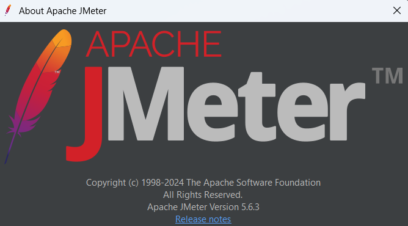
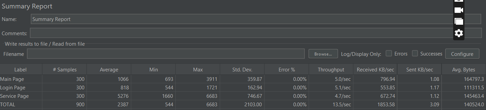
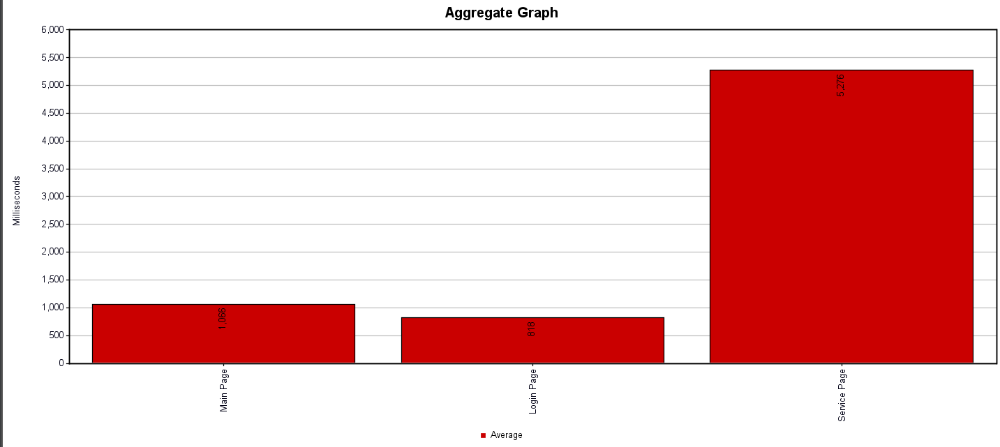
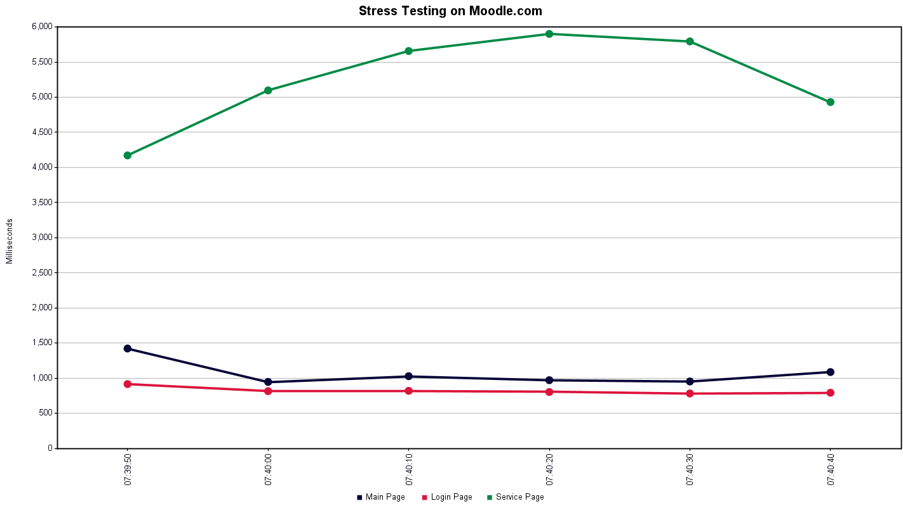

# 🧬 WEB PERFORMANCE TESTING 🧬

**Name:** Anis Nursabrina Lokman  
**Student ID:** 2025900087  
**Group:** 4C
**Course Code:** ITT440 - Network Programming  
**Tool Used:** Apache JMeter  
**Testing Type:** Stress Testing  
**Target Website:** Moodle (Online Learning Management System)
 

## 🧰 Objective
The objective of this stress test is to evaluate the performance, stability, and breaking point of the Moodle website when subjected to a heavy number of concurrent users.  
This test aims to identify bottlenecks, response delays, and potential resource exhaustion when the server is under maximum stress.

## ⚙️ Test Configuration And Methadology

| Configuration | Description |
|----------------|--------------|
| **Tool** | Apache JMeter 5.6.3 |
| **Target** | Moodle |
| **Number of Threads (Users)** | 300 for each page |
| **Ramp-up Period** | 30 seconds |
| **Loop Count** | 1 |
| **Sampler Type** | HTTP Requests (Main page, Login page, Service page) |
| **Listeners Used** | Graph Results, Summary Report, Response Time Graph |

---

## 🧩 Test Plan Setup
The test plan in JMeter consisted of:
- A **Thread Group** configured with 300 users, simulating high-traffic access to the Moodle website.  
- **Three HTTP Samplers** to simulate requests:
  1. Main Page (`https://moodle.com/`)
  2. Login Page (`https://moodle.com/login/`)
  3. Service Page (`https://moodle.com/services/`)
- Several **Listeners** were added to collect and visualize the test data, including:
  - Summary Report
  - Graph Results
  - Response Time Graph

---

## ✍🏿 Sample Output Data

### 🖼️ Summary Report Output

> The summary report lists the average, min, max response times, number of samples, and throughput values.  
> The service page displayed the highest latency and reduced throughput under high user load.

---

### 📈 Graph Results Viewer

> The Graph Results window demonstrates consistent trends with rising latency for the service page, confirming performance degradation under stress

---

### ⏱️ Response Time Graph

> The graph shows response times for each request during the 30-second stress test.  
> The main page (black line) response time showing moderate stability.
> The login page (red line) response time suggests good performance, efficient and lightweight.

---

## 📝 Results Summary
| Page | Minimum Response Time | Maximum Response Time | Observation |
|------|-----------------------|---------------------|--------------|
| **Main Page** | ~900 ms | ~1400 ms | Stable performance |
| **Login Page** | ~800 ms | ~900 ms | Consistent and efficient |
| **Service Page** | ~4200 ms | ~5900 ms | Increased response time – potential bottleneck |

---

## 🧠 Interpretation from summary report output
| Metric | Observation |
|--------------|----------------|
| Bottleneck | Service page is the slowest-performing page under load (Avg 5276 ms, Max 6683 ms) |
| Best Performance | Login page are the fast and consistent even during stress (Avg 818 ms) |
| System Stability | 0% error rate the server handled all request succesfully |
| Throughput Trend | Stable overall handling 13.5 request/sec (total) |
| Performance Issuse | High variation on Service Page |

---

## 💡 Recommendations for improvement
The Moodle website can better handle higher loads with reduced response time by improving caching, optimizing the database, and upgrading hardware resource. These will optimise the prevention of bottlenecks and ensurea consistent user experience even heavy traffic periods.  

---

## 📈 Conclusion
The Moodle demo website performed reliably under moderate load but showed signs of degradation as the number of users increased.  
Response times remained stable for lighter requests but rose significantly for resource-intensive operations, confirming a performance bottleneck under stress conditions.  

The test successfully identified the website’s performance limit and provided insights for future optimization and scaling strategies.

---

## 👩‍💻 Demonstration Video

